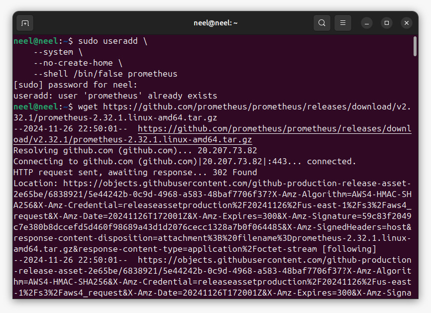
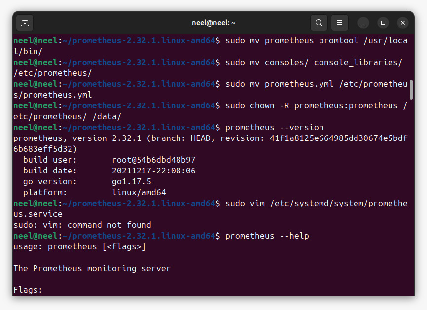
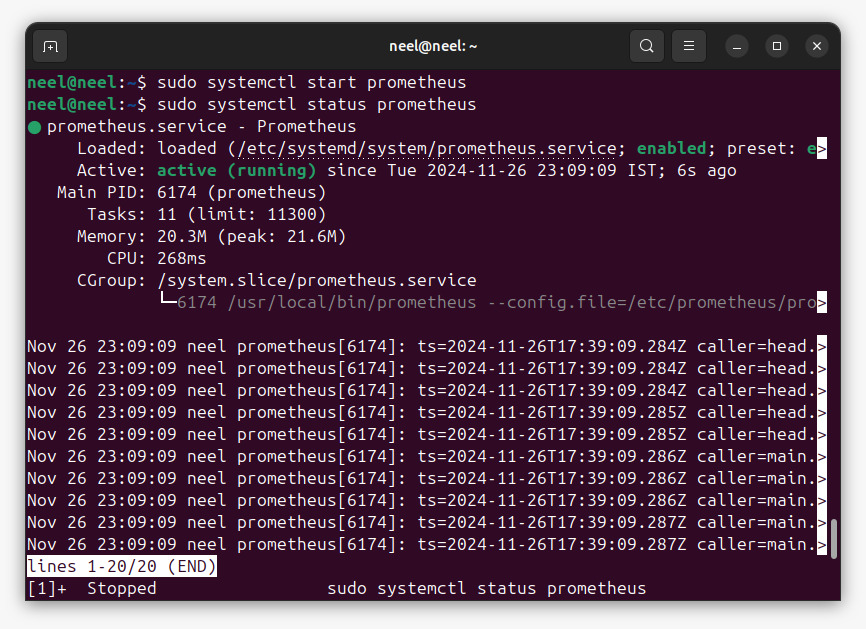
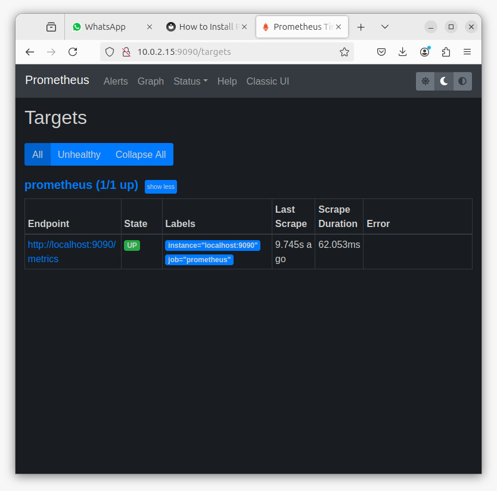
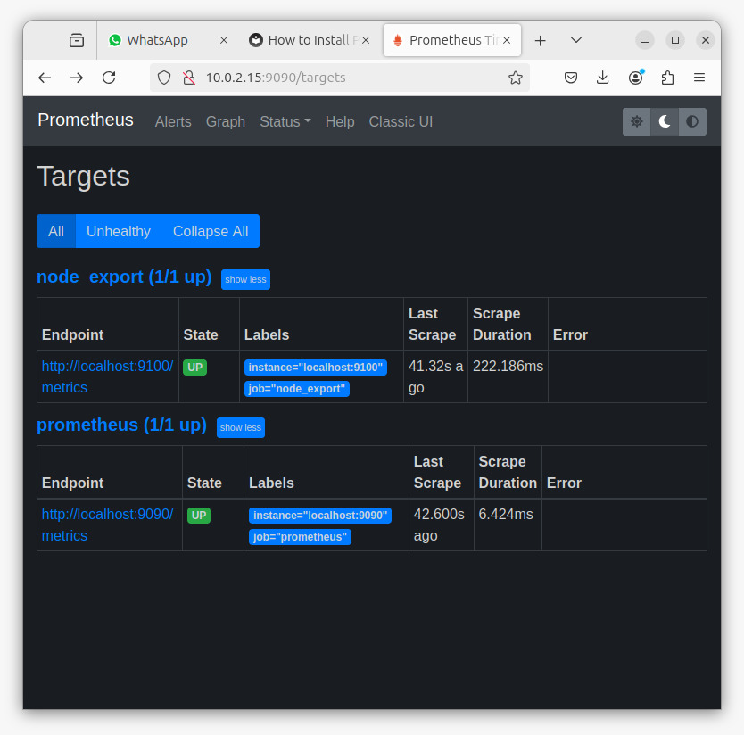
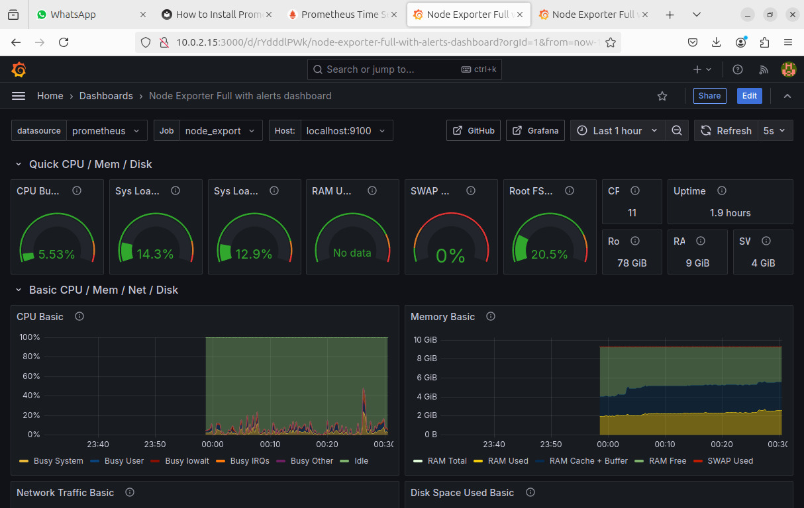
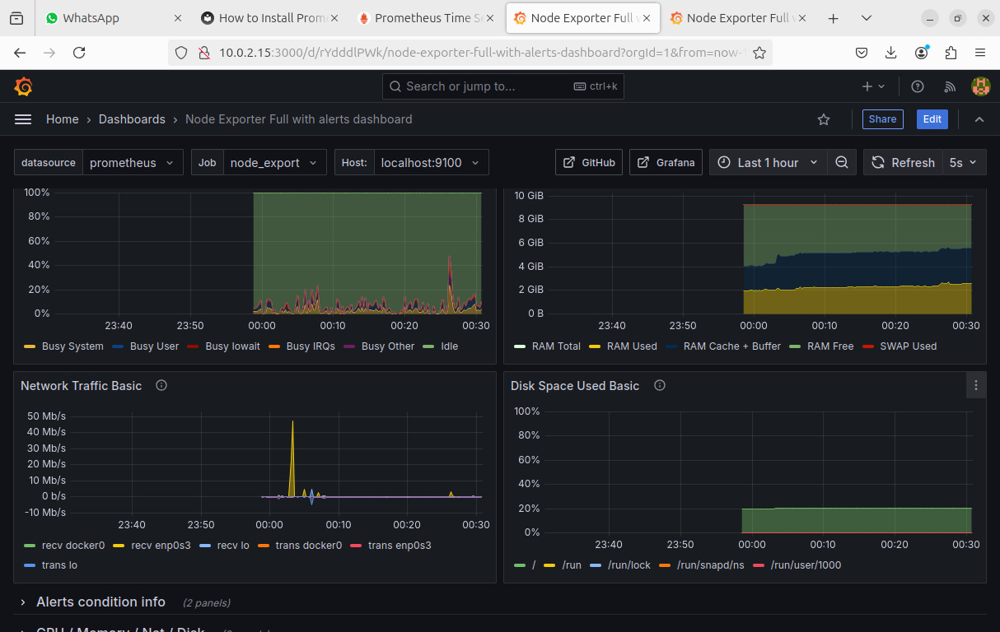
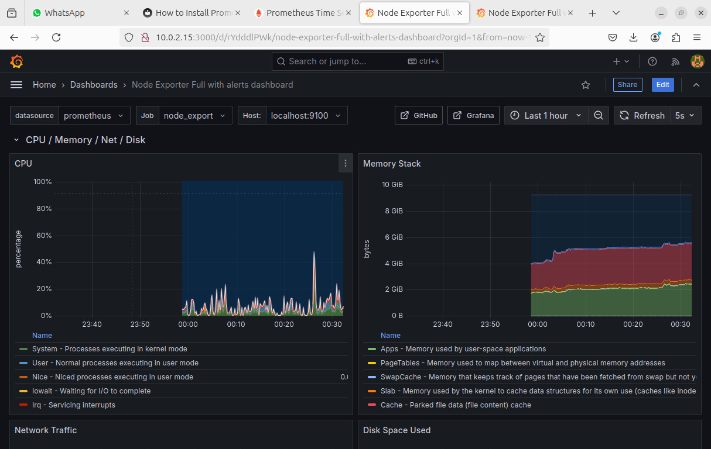
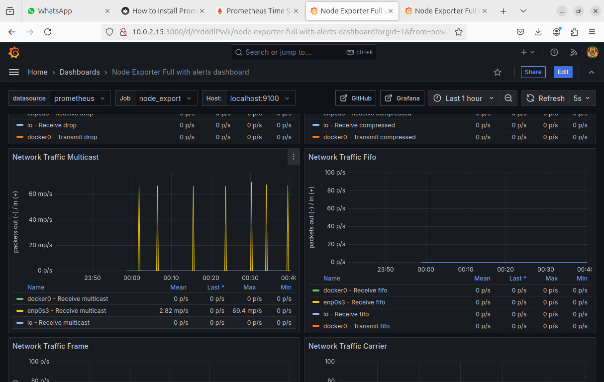
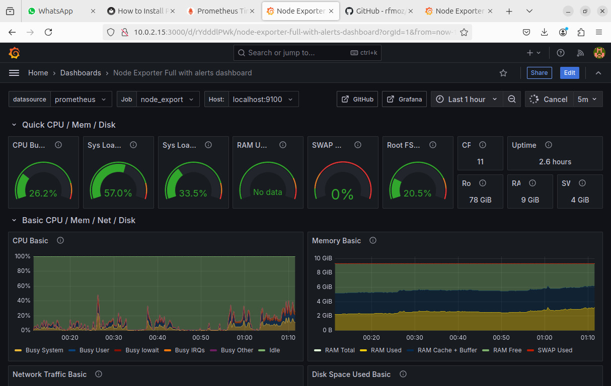

# **Green Future Network and Compute for Sustainability**  


> **Optimizing energy consumption in virtual machines with advanced monitoring and Machine Learning.**  

---

## **🚀 Project Overview**  
This project focuses on reducing energy consumption in Virtual Machines (VMs) and containers deployed in telecom Radio Access Networks (RAN) and Core networks. By leveraging **Prometheus**, **Grafana**, and **Machine Learning**, the project delivers insights and solutions for sustainable, energy-efficient operations, while adhering to **3GPP Energy Efficiency KPIs**.  

---

## **🛠️ Features**  
- **Real-time energy monitoring** using Prometheus and Grafana.  
- **3GPP Energy Efficiency KPI compliance** for standardized evaluation.  
- **Machine Learning integration** for predictive energy optimization.  

---

## **📂 Project Structure**  
```plaintext
root
├── images/                # images for illustration purposes
└── README.md              # Project documentation
```  

---

## **⚙️ Tech Stack**  
- **Languages**: Python, YAML  
- **Tools**: Prometheus, Grafana  
- **Libraries**: Scikit-learn, Pandas, NumPy  

---

## **🔧 Installation Guide**  

### **Install Prometheus, Node Exporter, and Grafana on Ubuntu 20.04**  

This guide includes steps for setting up **Prometheus**, **Node Exporter**, **Grafana**, and **Pushgateway** for short-lived jobs.  

---

### **📋 Prerequisites**  
- A server running **Ubuntu 20.04**.  
- Root or sudo access.  
- Basic Linux command knowledge.  

---

### **🚀 Installation Steps**  

#### **1. Install Prometheus**  
1. Create a dedicated user for Prometheus:  
   ```bash
   sudo useradd --system --no-create-home --shell /bin/false prometheus
   ```  

2. Download and extract Prometheus:  
   ```bash
   wget https://github.com/prometheus/prometheus/releases/download/v2.32.1/prometheus-2.32.1.linux-amd64.tar.gz
   tar -xvf prometheus-2.32.1.linux-amd64.tar.gz
   ```  

3. Set up directories and move files:  
   ```bash
   sudo mkdir -p /data /etc/prometheus
   cd prometheus-2.32.1.linux-amd64
   sudo mv prometheus promtool /usr/local/bin/
   sudo mv consoles/ console_libraries/ /etc/prometheus/
   sudo mv prometheus.yml /etc/prometheus/prometheus.yml
   ```  

4. Adjust ownership and permissions:  
   ```bash
   sudo chown -R prometheus:prometheus /etc/prometheus /data
   ```  

5. Create a systemd service for Prometheus:  
   ```bash
   sudo vim /etc/systemd/system/prometheus.service
   ```  
   Add the following content:  
   ```ini
   [Unit]
   Description=Prometheus
   Wants=network-online.target
   After=network-online.target

   [Service]
   User=prometheus
   Group=prometheus
   ExecStart=/usr/local/bin/prometheus \
     --config.file=/etc/prometheus/prometheus.yml \
     --storage.tsdb.path=/data

   [Install]
   WantedBy=multi-user.target
   ```  

6. Start and enable the service:  
   ```bash
   sudo systemctl enable prometheus
   sudo systemctl start prometheus
   sudo systemctl status prometheus
   ```  

---

#### **2. Install Node Exporter**  
1. Create a dedicated user:  
   ```bash
   sudo useradd --system --no-create-home --shell /bin/false node_exporter
   ```  

2. Download and extract Node Exporter:  
   ```bash
   wget https://github.com/prometheus/node_exporter/releases/download/v1.3.1/node_exporter-1.3.1.linux-amd64.tar.gz
   tar -xvf node_exporter-1.3.1.linux-amd64.tar.gz
   ```  

3. Move binary and clean up:  
   ```bash
   sudo mv node_exporter-1.3.1.linux-amd64/node_exporter /usr/local/bin/
   rm -rf node_exporter*
   ```  

4. Create a systemd service:  
   ```bash
   sudo vim /etc/systemd/system/node_exporter.service
   ```  
   Add the following content:  
   ```ini
   [Unit]
   Description=Node Exporter
   Wants=network-online.target
   After=network-online.target

   [Service]
   User=node_exporter
   Group=node_exporter
   ExecStart=/usr/local/bin/node_exporter

   [Install]
   WantedBy=multi-user.target
   ```  

5. Start and enable Node Exporter:  
   ```bash
   sudo systemctl enable node_exporter
   sudo systemctl start node_exporter
   sudo systemctl status node_exporter
   ```  

6. Configure Prometheus to scrape Node Exporter:  
   Add this to `/etc/prometheus/prometheus.yml`:  
   ```yaml
   scrape_configs:
     - job_name: 'node_exporter'
       static_configs:
         - targets: ['localhost:9100']
   ```  

---


#### **3. Install Grafana**  
1. Add GPG key and repository:  
   ```bash
   wget -q -O - https://packages.grafana.com/gpg.key | sudo apt-key add -
   echo "deb https://packages.grafana.com/oss/deb stable main" | sudo tee /etc/apt/sources.list.d/grafana.list
   ```  

2. Install Grafana:  
   ```bash
   sudo apt-get update
   sudo apt-get install -y grafana
   ```  

3. Start and enable Grafana:  
   ```bash
   sudo systemctl enable grafana-server
   sudo systemctl start grafana-server
   sudo systemctl status grafana-server
   ```  

4. Add Prometheus as a Grafana data source:  
   - Navigate to **Configuration > Data Sources > Add Data Source**.  
   - Select **Prometheus** and enter `http://localhost:9090` as the URL.  
   - Click **Save & Test**.  

---

## **📊 Example Visualizations**  





*Real-time energy metrics displayed using Grafana.*  

---

## **🌱 Future Work**  
- Implement advanced ML models for energy prediction.  
- Explore integration with other energy monitoring platforms.  
- Enhance scalability for large telecom deployments.  

---

## **💡 Contributing**  
Contributions are welcome! Please check the [CONTRIBUTING.md](CONTRIBUTING.md) file for guidelines.  

---

## **📜 License**  
This project is licensed under the [MIT License](LICENSE).  

---

## **📞 Contact**  
**Project Lead**: Neel Madhav Padhi
- Email: [nmp1721@gmail.com](mailto:nmp1721@gmail.com)
- LinkedIn: [Neel Madhav Padhi](https://www.linkedin.com/in/neel-madhav-padhi-921868295/) 
- Email: [darshangoje@gmail.com](mailto:darshangoje@gmail.com) 
- LinkedIn: [Darshan Hangoje](https://www.linkedin.com/in/darshan-hangoje-0344b1258/)  
```

